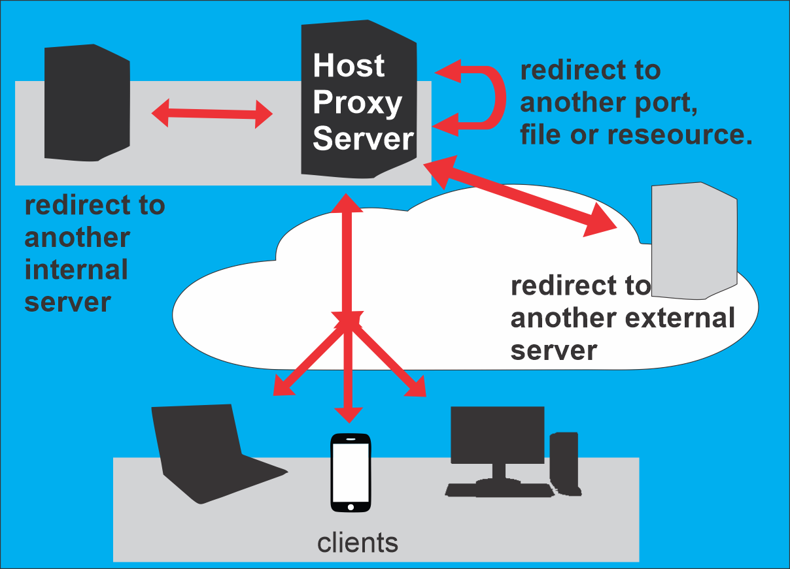

# HostProxy
 Servidor Web de redirecioanmento de portas baseado no hostname.

## Como funciona?
 O servidor recebe a requisição HTTP/HTTPS e com base no **hosname** da solicitação redireciona o tráfego para outra porta, arquivo ou outro servidor interno ou externo.

### Diagrama de funcionamento:
 

 ## Dúvidas e contatos pelo
  [E-mail](mailto:contato@leandrorego.com)
